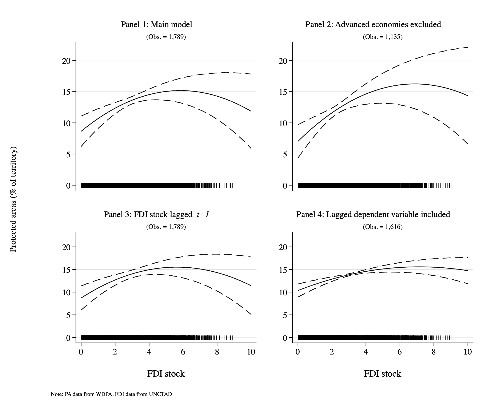

Good for the economy, good for the planet? How foreign direct investment affects protected areas (with Ana Carolina Garriga). 2023.

### Abstract

Despite a growing literature analyzing the effects of globalization on the environment, we know little about how economic openness affects biodiversity. This paper focuses on the incentives that foreign direct investment (FDI) poses on governments’ foremost strategy to protect biodiversity: the establishment of protected areas. Protected areas have expanded in most countries, but they have done so at varying rates, which is not explained merely by geography or development. We argue that FDI is positively associated with the existence and expansion of protected areas through two channels. First, countries use protected areas to attract and protect extant FDI because multinational corporations can obtain reputational benefits from host countries’ commitment to environmental norms (reputational mechanism). Second, the establishment of protected areas rarely entails expropriation of extant investment. Thus, new protected areas potentially shield current investment from domestic or international competition for the use of comparable land or resources. Our argument, although consistent with the <em>California effect</em> expectations, differs in the logic driving this effect, and on the non-linear expectation of the effect. Panel data analyses on a sample of 60 developed and developing countries strongly support our expectations. Our findings shed new light on globalization’s non-economic implications and adds to our understanding about how international factors influence the provision of public goods.

### ToC figure: FDI's dinimishing effects on protected areas with 95% CI

  

