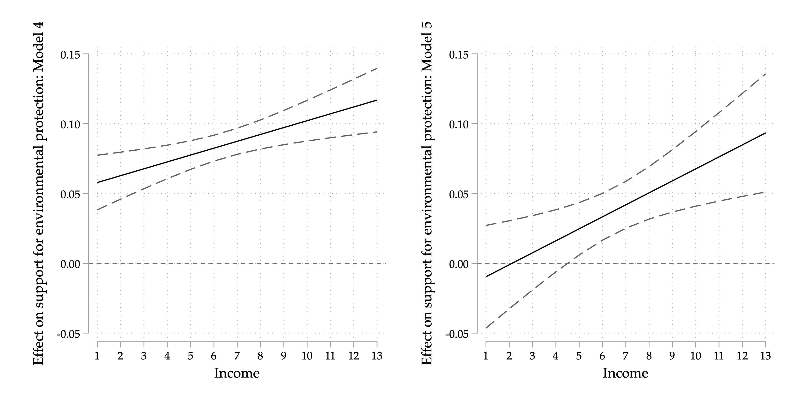

Supporting environmental protection in good and bad economic circumstances (with Tobias Böhmelt). 2023. *Environmental Politics*, 1&ndash;19. DOI: 10.1080/09644016.2023.2200653. <a href="https://www.tandfonline.com/doi/abs/10.1080/09644016.2023.2200653" target="_blank"><i class="fas fa-fw fa-link"></i></a>[published version (OA)]

### Abstract

This article explores the scope conditions of the effect of individual political orientation on environmental beliefs, focusing on personal economic circumstances. Distinguishing between willingness and opportunity factors, it is argued that the positive effect of left-wing ideology on public support for environmental protection is more strongly pronounced when individuals’ personal economic circumstances are better as potentially more costly regulations can be paid for. We test the theory using three different data sets from three different contexts: the German Longitudinal Election Study, the Cooperative Election Study (US), and Eurobarometer data. The analyses provide strong and robust evidence in line with our expectations. This research adds to our understanding of the role of political ideology as well as economic conditions in environmental public-opinion formation, and we shed light on the interactive influence of self-interest and political predisposition.

### ToC figure: Marginal effects (90% CIs) of leftist ideology on support for environmental protection (juxtaposed with economic growth), GLES data.

  

