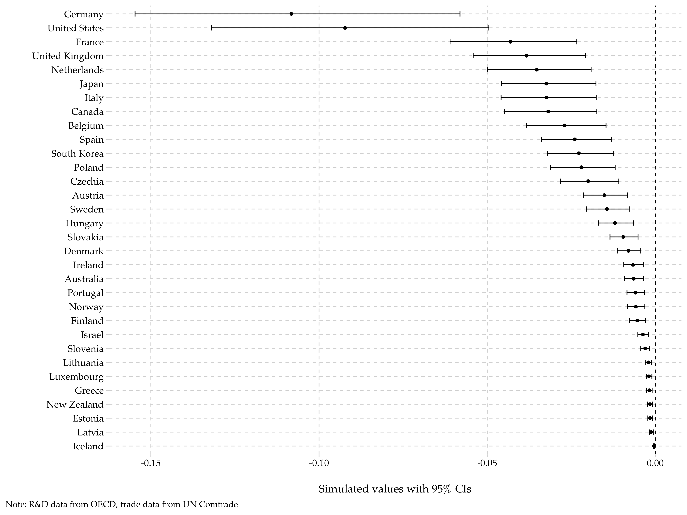

Trade and the government underfunding of environmental innovation. 2023. R&R, *Journal of Environmental Studies and Sciences*.

### Abstract

How does trade affect the making and implementation of environmental policies? I extend our understanding about this broad research question with an understudied case: government support for environmental innovation. As the foremost channel wherein the cross-border technology transfer occurs, trade materializes the positive externality of technology investment. With that in mind, countries may tend to strategically underfund environmental technologies&mdash;particularly when their trade partners enlarge that spending&mdash;to have more money to use otherwise and to avoid politically awkward innovation failures. To substantiate this crowding out argument, I perform spatial regression with data from 32 OECD countries, 1982&ndash;2017, and find that government spending on environmental R&D in one country is negatively correlated with that of the country's trade partners in environmental goods. My research contributes to the literature by adding new to our understanding about the international trade-environmental policy nexus, depicting a new scenario wherein states underprovide global public goods, and showing the strategic calculus underlying the use of technology-push strategy in addressing climate change.

### ToC figure: negative spillover (crowding-out) effects of each country's government environmental R&D spending

  

