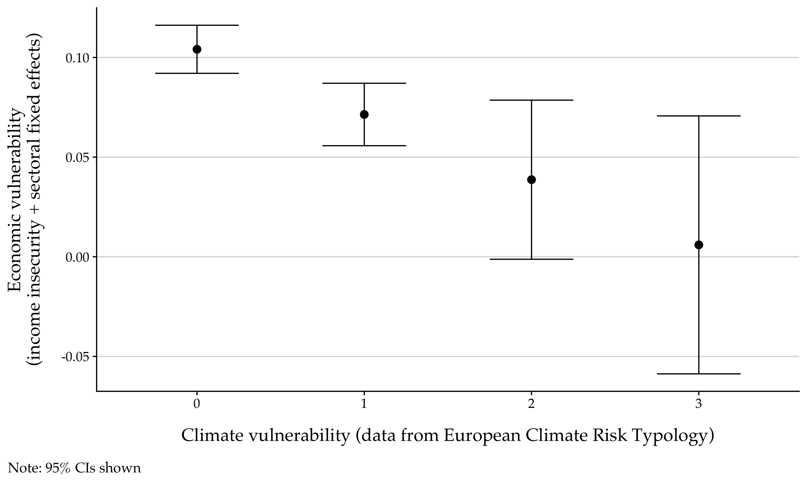

Cross-cutting vulnerabilities and preference updating on climate mitigation. <a href="/files/xcutting_vulnerabilities.pdf" target="_blank"><i class="fas fa-fw fa-link"></i></a>[early draft]

### Abstract

Underlying many political tensions amid climate mitigation is distributive conflict, with "losers" including not only workers at risk to decarbonization but also the underprivileged who pay relatively more on the consumer end. With climate change unfolding rapidly, more and more economically vulnerable individuals are at the same time vulnerable to climate hazards. Do people update their policy preferences on climate mitigation when they are cross-pressured by these cross-cutting vulnerabilities? I answer this question empirically using data from the European Social Survey together with find-grained indicators on regional susceptibility to various climate disasters. I find that economic vulnerability, proxied by income insecurity, becomes irrelevant to public opposition to carbon taxes when climate vulnerability is high. But such "cross-pressuring" effect seems nonexistent among direct "losers" in decarbonization. Given the distributional effects of climate hazards, this paper extends the scope of distributive conflict in climate change politics and also sheds new light on the environmental justice literature. Other contributions are also discussed.

### ToC figure: Climate vulnerability attenuating the effect of economic vulnerability on public opposition to "increasing taxes on fossil fuels to reduce climate change" (1–5), ESS8 data.

  
